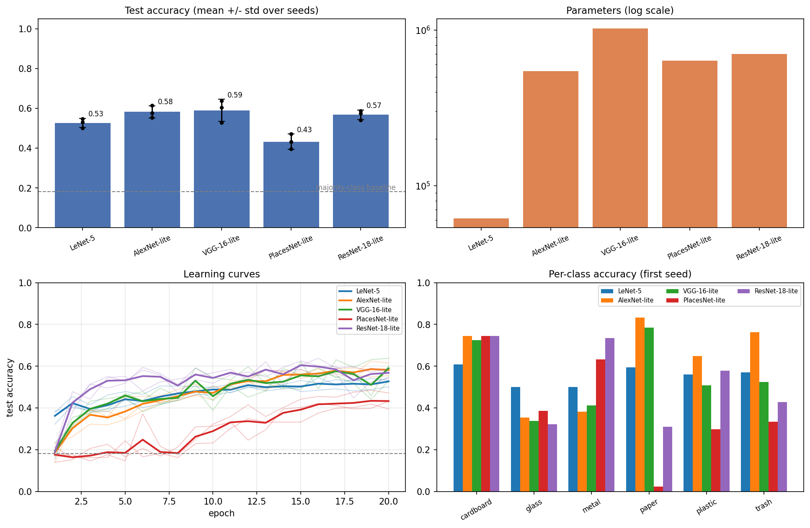
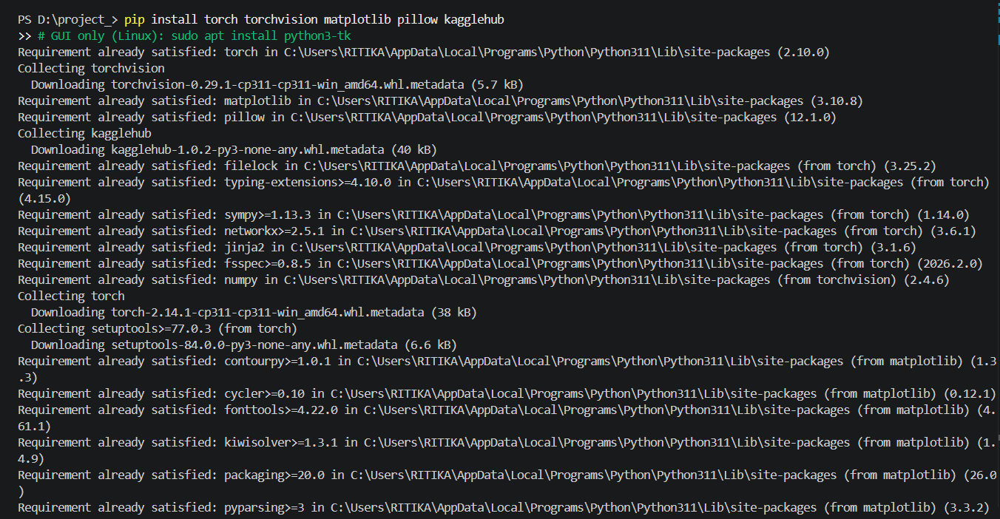

# Deep CNN Architectures: Garbage Classification

A PyTorch mini project comparing five CNN architectures on a garbage classification dataset.

## Overview

This project compares the following CNN architectures under the same training conditions:

* LeNet-5
* AlexNet-lite
* VGG-16-lite
* PlacesNet-lite
* ResNet-18-lite

The models are trained on a six-class garbage classification dataset and evaluated using the same train/test split, optimizer, learning rate, batch size, loss function, and number of epochs.

A small Tkinter application is also included to run predictions using all five trained models on a user-provided image.

## Dataset

**Dataset:** [Garbage Classification](https://www.kaggle.com/datasets/asdasdasasdas/garbage-classification)

The dataset contains 2,527 RGB images across six classes:

* Cardboard
* Glass
* Metal
* Paper
* Plastic
* Trash

Because the classes are imbalanced, each class was capped at twice the size of the smallest class, resulting in **1,507 images**.

The images were:

* Resized to **32 × 32**
* Normalized to the range **-1 to 1**
* Split into **80% training / 20% testing**
* Evaluated using the same fixed split for every model

| Class     |  Original | After Balancing |     Train |    Test |
| --------- | --------: | --------------: | --------: | ------: |
| Cardboard |       403 |             274 |       223 |      51 |
| Glass     |       501 |             274 |       212 |      62 |
| Metal     |       410 |             274 |       206 |      68 |
| Paper     |       594 |             274 |       232 |      42 |
| Plastic   |       482 |             274 |       217 |      57 |
| Trash     |       137 |             137 |       116 |      21 |
| **Total** | **2,527** |       **1,507** | **1,206** | **301** |

## Model Architectures

| Model              | Parameters | Main Idea                                                        |
| ------------------ | ---------: | ---------------------------------------------------------------- |
| **LeNet-5**        |     61,666 | Convolution + average pooling with tanh                          |
| **AlexNet-lite**   |    542,918 | 5 convolutional layers, pooling and fully connected layers       |
| **VGG-16-lite**    |  1,023,254 | 13 convolutional layers using 3×3 convolutions                   |
| **PlacesNet-lite** |    635,181 | AlexNet-lite body with a 365-way output layer                    |
| **ResNet-18-lite** |    700,950 | Residual blocks with skip connections and global average pooling |

The full-size architectures were scaled down for 32×32 input images.

## Experimental Setup

All five networks were trained under the same conditions:

* **Optimizer:** Adam
* **Learning rate:** 1e-3
* **Batch size:** 64
* **Loss:** Cross-entropy
* **Epochs:** 20
* **Training images:** 1,206
* **Test images:** 301
* **Random seeds:** 0, 1, 2
* **Hardware:** Google Colab GPU

The reported accuracy is the mean ± standard deviation across the three seeds.

The majority-class baseline is **0.182**.

## Results

| Model              | Parameters | Mean Test Accuracy | Std. Dev. |
| ------------------ | ---------: | -----------------: | --------: |
| **VGG-16-lite**    |  1,023,254 |          **0.590** |     0.056 |
| **AlexNet-lite**   |    542,918 |          **0.583** |     0.030 |
| **ResNet-18-lite** |    700,950 |          **0.568** |     0.024 |
| **LeNet-5**        |     61,666 |          **0.527** |     0.024 |
| **PlacesNet-lite** |    635,181 |          **0.433** |     0.038 |



### Key Findings

* **VGG-16-lite** achieved the highest mean test accuracy at **59.0%**.
* **AlexNet-lite** was very close at **58.3%**.
* **ResNet-18-lite** achieved **56.8%** and was the most stable of the top three across seeds.
* **LeNet-5** achieved **52.7%** with only **61,666 parameters**, making it the best model in terms of accuracy relative to model size.
* **PlacesNet-lite** performed substantially worse at **43.3%**, despite having a similar architecture to AlexNet-lite.
* All five models performed well above the **18.2% majority-class baseline**.

The top three models cannot be reliably separated based on this small test set of 301 images.

## Confusion Analysis

The most common errors involved visually similar classes such as:

* Plastic ↔ Glass
* Glass → Metal
* Metal → Paper
* Plastic/Paper → Metal

At 32×32 resolution, details such as transparency, texture, and material appearance are lost, making glass, plastic, and metal particularly difficult to distinguish.

The **Trash** class has only 21 test images, so its per-class performance is less reliable.

## Tkinter Application

`gui_app.py` provides a simple local GUI for testing the trained models.

The application:

1. Loads the five trained models.
2. Allows the user to select an image.
3. Displays the prediction and confidence from each model.
4. Shows the majority vote across the five models.

The application uses the saved model weights in the `models/` directory.

### Example



The application was also tested on images that were not part of the training dataset.

On six clearly labelled external images, the majority vote was correct **3 out of 6 times**. This small sample should not be treated as a reliable evaluation.

Interestingly, the external-image results differed from the test-set ranking. Some incorrect predictions were also made with very high confidence, showing that the confidence values should not automatically be interpreted as reliable certainty.

## Project Structure

```text
waste_classification_deep_cnn_architectures/
│
├── images/
│   └── dataset/example images
│
├── models/
│   ├── AlexNet-lite.pt
│   ├── LeNet-5.pt
│   ├── PlacesNet-lite.pt
│   ├── ResNet-18-lite.pt
│   ├── VGG-16-lite.pt
│   └── meta.json
│
├── gui_app.py
├── train_colab_mini_project.ipynb
├── comparison.png
├── screenshot.png
├── requirements.txt
└── README.md
```

## How to Run

### 1. Clone the repository

```bash
git clone https://github.com/RitikaKalia9/waste_classification_deep_cnn_architectures.git
cd waste_classification_deep_cnn_architectures
```

### 2. Install dependencies

```bash
pip install -r requirements.txt
```

### 3. Run the GUI

```bash
python gui_app.py
```

Select an image when prompted to view predictions from all five models.

### Training

The training notebook is:

```text
train_colab_mini_project.ipynb
```

It is designed to be run in Google Colab with a GPU.

## Limitations

The relatively low test accuracy is influenced by several factors:

* Only **1,507 images** were used after balancing.
* Images were reduced to **32×32** pixels.
* The models were trained for only **20 epochs**.
* The dataset contains visually similar classes.
* The Trash class has relatively few samples.
* External images differ from the dataset because they often contain piles, backgrounds, and multiple objects.

## Possible Improvements

Potential improvements include:

* Using larger input images such as 64×64 or higher.
* Applying data augmentation.
* Fine-tuning pretrained models.
* Training for more epochs.
* Using a learning-rate schedule.
* Using cross-validation or a larger test set.
* Adding more examples of the Trash class.
* Reporting the average accuracy over the final few epochs rather than relying only on the final epoch.

## Conclusion

On this garbage classification dataset, **VGG-16-lite achieved the highest mean accuracy (59.0%)**, closely followed by **AlexNet-lite (58.3%)** and **ResNet-18-lite (56.8%)**.

However, **LeNet-5 provided the best accuracy relative to model size**, achieving 52.7% accuracy with only 61,666 parameters.

The experiment also shows that deeper or larger architectures do not automatically perform better on a small dataset, and that model performance can change considerably when images differ from the training distribution.
